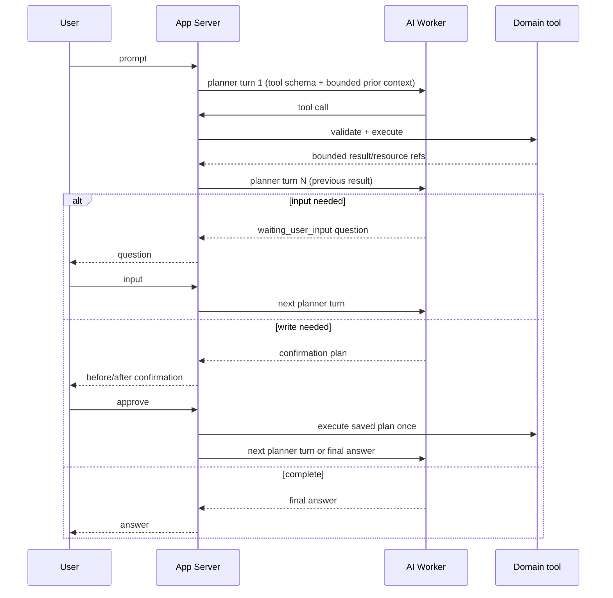

# Meeting Agent 다단계 Workflow 설계

> 상태: 확정 설계. 이 문서는 아직 구현되지 않은 API·DB 계약을 정의하며,
> 현재 동작 기준은 [Agent API](api/agent-api.md)와 [Meeting API](api/meeting-api.md)다.

## 확정된 제품 결정

- `meeting_report_action_items`의 저장 row가 회의의 **후속작업**이다. LLM 원본 후보 JSON은
  업무 추적 대상으로 사용하지 않는다.
- 후속작업 승인 시 Calendar 일정과 Board issue를 자동 생성한다. 사용자가 별도의
  “일정 생성”, “이슈 생성” 명령을 다시 할 필요는 없다.
- 생성된 일정·이슈는 원본 후속작업과 FK 관계로 저장한다. 이후 Activity Log를 후속작업
  관계 또는 `parent_type`/`parent_id`로 추적할 수 있어야 한다.
- 결정사항 evidence는 해당 decision item을 가리키는 evidence reference가 있을 때만 보여준다.
  유사성·LLM 추론만으로 evidence를 붙이지 않는다.
- Chatbot은 회의 참여·나가기·녹음 시작·녹음 종료를 직접 제어한다. 모든 상태 변경은
  confirmation을 거친다.
- Agent run은 한 요청 안에서 여러 tool을 순서대로 실행할 수 있다. 이를 위해 이전 사용자
  입력·Agent 질문·tool 결과를 다음 planner turn에 전달하는 **run 범위 multi-turn memory**를
  저장한다. 필요한 정보가 없거나 확인이 필요할 때만 사람에게 제어를 넘긴다.

## 공통 불변식

- AI Worker는 Meeting·Calendar·Board DB나 service를 직접 호출하지 않는다. App Server의
  tool adapter만 기존 domain service를 호출한다.
- tool output, planner context, outbox에는 token, LiveKit credential, provider raw payload,
  transcript 전문을 저장하지 않는다.
- multi-turn memory는 영구 사용자 프로필 memory가 아니다. 해당 `agent_run`의 append-only
  message와 bounded tool summary·resource reference만으로 구성하며, run 종료 뒤 다른 run에
  자동 주입하지 않는다.
- 외부 GitHub write는 DB transaction으로 rollback할 수 없으므로 action item 승인과
  deliverable 생성은 durable saga로 처리한다.
- 사용자 확인은 write 실행 전의 `confirmation`이고, 정보 보완을 위한 질문은
  `waiting_user_input`이다. 둘은 같은 상태가 아니다.

## 다단계 Agent loop



### Run 상태와 API

기존 `planning`, `running`, `waiting_confirmation`, `completed`, `failed`, `cancelled`에
`waiting_user_input`을 추가한다.

- `POST /workspaces/{workspaceId}/agent/runs/{runId}/inputs`
  - body: `{ "message": "금요일 오후 3시" }`
  - 현재 사용자가 `waiting_user_input`인 자신의 run에만 입력할 수 있다.
  - 입력을 append-only message로 저장하고 다음 planner turn outbox를 같은 transaction에서 만든다.
- 기존 confirmation approve는 저장된 composite plan을 정확히 한 번 실행한 뒤, 성공·안전한
  실패 결과를 다음 planner turn에 전달한다.
- Agent run detail은 사용자가 쓴 보완 입력, Agent 질문, step의 bounded summary와
  pending confirmation을 시간 순서로 반환한다. transcript·credential은 포함하지 않는다.

### 저장과 멱등성

새 Agent 저장 구조는 다음을 둔다.

| 대상 | 역할 |
| --- | --- |
| `agent_run_messages` | user 보완 입력과 assistant 질문. `run_id`, sequence, role, bounded text를 저장한다. |
| `agent_run_turn_outbox` | 다음 planner turn을 durable하게 발행한다. `run_id`, turn sequence, reason, claim/retry를 가진다. |
| 기존 `agent_steps` | planner/tool/answer의 실행 이력과 bounded output을 계속 저장한다. 이 세 대상이 run 범위 multi-turn memory의 저장 기반이다. |

한 run은 planner turn과 tool call을 각각 최대 8회까지 허용한다. 한계를 넘으면 안전한
`failed`가 아니라 `waiting_user_input`으로 전환해 사용자가 요청을 좁히도록 한다. 같은
turn outbox, tool step, confirmation은 `(run_id, turn_sequence)` 또는 실행 claim으로 멱등하게 만든다.

## 후속작업 승인과 일정·이슈 자동 생성

### 입력을 수집하는 loop

`approve_meeting_report_action_item`은 다음 정보가 완전할 때만 confirmation을 만든다.

- action item 식별자와 현재 `PENDING` 상태
- Calendar 제목·날짜·종일 또는 시간
- Board와 생성할 초기 column

날짜/시간이 없거나 Board가 여러 개이면 Agent는 `list_calendar_events` 또는 Board 조회 결과를
사용해 추측하지 않고 `waiting_user_input`으로 질문한다. 즉, 승인 뒤 생성은 자동이지만
필수 업무 정보는 사람이 loop에서 제공한다.

### delivery saga

기존 `PENDING → APPROVED` 단일 전이를 아래 상태로 확장한다.

```text
PENDING -> DELIVERING -> APPROVED
                    -> DELIVERY_FAILED -> DELIVERING (retry)
PENDING -> DISMISSED
```

`APPROVED`는 Calendar event와 Board issue가 모두 생성되고 관계가 저장된 뒤에만 설정한다.
GitHub issue 생성이 실패하면 이미 생성된 Calendar event를 삭제하지 않는다. `DELIVERY_FAILED`에
원인과 각 deliverable 결과를 남기고 idempotency key로 재시도한다.

새 `meeting_report_action_item_deliveries`는 action item당 종류별 한 행을 갖는다.

| Field | 규칙 |
| --- | --- |
| `action_item_id` | `meeting_report_action_items.id` FK. |
| `delivery_type` | `calendar_event` 또는 `pilo_issue`. |
| `status` | `PENDING`, `RUNNING`, `COMPLETED`, `FAILED`. |
| `calendar_event_id` | Calendar delivery일 때 `calendar_events.id` FK, 그 외 null. |
| `pilo_issue_id` | Issue delivery일 때 `pilo_issues.id` FK, 그 외 null. |
| `draft_json` | confirmation으로 확정된 최소 Calendar/Board 입력. |
| `idempotency_key` | GitHub 재시도 중 중복 issue 생성을 막는 고유 키. |
| `attempt_count`, `last_error_code` | 안전한 재시도 상태. provider raw error는 저장하지 않는다. |

`UNIQUE(action_item_id, delivery_type)`와 “정확히 한 target FK만 존재” check를 둔다.
이 table이 후속작업 → 일정/이슈의 정규 관계다.

Activity Log는 다음 parent를 기록한다.

- action item 승인: target `meeting_report_action_item`
- Calendar 생성: `parent_type = 'meeting_report_action_item'`, `parent_id = action_item_id`
- Board issue 생성: 같은 parent

따라서 후속작업 detail은 delivery FK로 현재 자원을 조회하고, `activity_logs.parent_*`로
생성·수정 이력을 직접 조회할 수 있다.

## 결정사항 evidence

현재 `meeting_reports.decisions`는 하나의 text라 여러 결정을 독립적으로 근거화할 수 없다.
새 `meeting_report_decision_items`를 추가한다.

| Field | 규칙 |
| --- | --- |
| `meeting_report_id`, `source_index` | report 안에서 결정 item을 안정적으로 식별하며 unique다. |
| `text` | 결정 내용. 기존 `decisions` text는 호환용 표시 필드로 유지한다. |
| `created_at` | Worker 저장 시각. |

AI Worker는 decision item 배열과 각 item의 `source_index`를 저장한다. transcript evidence와
Activity evidence reference는 `source_type = 'decision'` 및 같은 `source_index`일 때만 해당
결정에 표시한다. reference가 없는 결정은 “근거 없음”으로만 보이고 다른 결정의 evidence를
공유하지 않는다. 과거 report는 기존 단일 decision block을 `source_index = 0`인 legacy item으로
읽는다.

후보 read tool은 `get_meeting_decision_evidence`다. 입력은 `reportId`와 선택 `decisionIndex`이며,
반환은 decision text, 직접 연결된 transcript segment 요약, 직접 연결된 Activity evidence 요약뿐이다.

## Chatbot 회의 직접 제어

모든 제어 tool은 `medium` / `confirmation_required`다.

| Tool | 실행 계약 |
| --- | --- |
| `start_meeting_in_room` | 방을 해소하고 MeetingService로 회의를 시작한다. 동의가 없으면 confirmation에 현재 policy version 동의를 포함한다. |
| `join_meeting` | participant session을 생성/재사용한다. 성공 후 Frontend에 안전한 `connect_meeting` client action을 준다. LiveKit token은 run/step에 저장하지 않는다. |
| `leave_meeting` | 현재 session만 종료한다. 마지막 participant면 녹음 종료·회의 종료 영향이 confirmation에 표시된다. |
| `start_meeting_recording` | active participant·전체 동의를 서버가 재검증한 뒤 Egress를 시작한다. |
| `end_meeting_recording` | current recording을 서버가 해소해 종료하고 MeetingReport job을 만든다. planner가 recording ID를 추측하지 않는다. |

`connect_meeting`은 Meeting 화면으로 이동시키는 UI action이다. 화면은 기존 인증된 join 경로를
다시 호출해 LiveKit token을 메모리에서만 받아 연결한다. Agent가 먼저 만든 active participant
session은 idempotent join으로 재사용되므로 token을 Agent 저장소에 보관할 필요가 없다.

## 구현 체크리스트

### DB·도메인 계약

- [ ] DB Schema owner와 `meeting_report_action_items` 상태 확장 및 delivery table FK를 확정한다.
- [ ] Calendar·Board owner와 delivery saga의 service 경계, GitHub idempotency key, retry 정책을 확정한다.
- [ ] action item 승인 endpoint를 composite delivery input/상태 조회 계약으로 변경한다.
- [ ] Activity Log Registry에 action item approval/delivery parent 규칙을 추가한다.
- [ ] decision item table과 Worker output schema·legacy `source_index = 0` 호환을 추가한다.

### Agent loop

- [ ] `waiting_user_input`, message API, turn outbox, turn claim/retry를 구현한다.
- [ ] planner가 `tool_call`, `needs_user_input`, `final`을 반환하도록 Worker schema를 확장한다.
- [ ] App Server가 한 tool 결과를 다음 planner turn에 bounded context로 전달한다.
- [ ] confirmation approve/reject 뒤 loop 재개와 8회 budget을 검증한다.

### Tool·Frontend

- [ ] `find_action_items`, `get_meeting_decision_evidence` read tool을 추가한다.
- [ ] composite action item approval tool과 delivery 상태 formatter를 추가한다.
- [ ] 회의 직접 제어 tool과 `connect_meeting` client action을 추가한다.
- [ ] Agent chat UI에 clarification 입력, confirmation, step timeline, Meeting 이동 action을 추가한다.

### 검증

- [ ] action item → Calendar/Board relation·Activity parent query를 실제 Postgres에서 검증한다.
- [ ] GitHub 실패 뒤 retry가 같은 issue를 중복 생성하지 않는지 검증한다.
- [ ] 직접 evidence reference가 없는 decision에 transcript/Activity evidence가 표시되지 않는지 검증한다.
- [ ] 2개 이상 tool call, user input, confirmation, 재개, timeout/budget 초과의 E2E를 검증한다.
- [ ] 녹음 동의 없는 join/start, 마지막 participant leave, recording 종료의 confirmation 경로를 검증한다.

## 소유·리뷰 경계

- Meeting·Infra/Realtime: 진호
- DB schema: 은재
- Calendar: 세인
- Board/GitHub issue write: 주형
- Agent runtime은 공용 App Server 영역이므로 `APP_SERVER_COMMON_AREAS.md` 기준 영향·검증을 PR에 명시한다.
