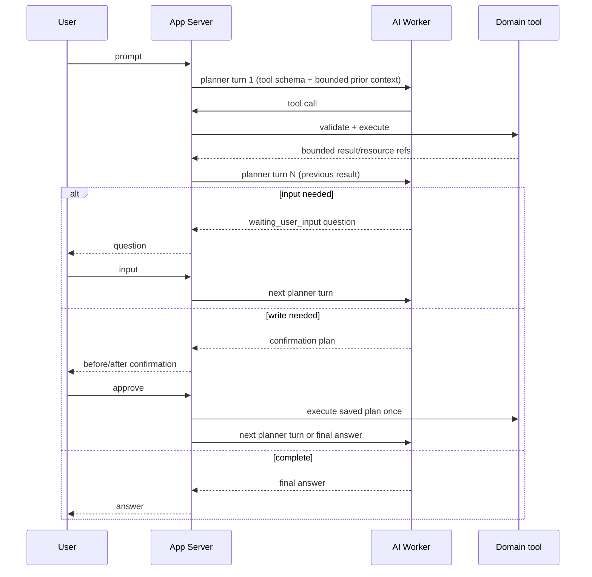

# Meeting Agent 다단계 Workflow 설계

> 상태: 구현 계약. 현재 동작 기준은 이 문서와 [Agent API](api/agent-api.md),
> [Meeting API](api/meeting-api.md)다.

## 확정된 제품 결정

- `meeting_report_action_items`의 저장 row가 회의의 **후속작업**이다. LLM 원본 후보 JSON은
  업무 추적 대상으로 사용하지 않는다.
- 후속작업 승인 시 사용자가 선택한 하나의 Calendar 일정 또는 Board issue를 자동 생성한다. 사용자가 별도의
  “일정 생성”, “이슈 생성” 명령을 다시 할 필요는 없다.
- 생성된 일정·이슈는 원본 후속작업과 FK 관계로 저장한다. 이후 Activity Log는 해당 resource의
  기존 target 관계로 추적할 수 있어야 한다.
- 결정사항 evidence는 해당 decision item을 가리키는 evidence reference가 있을 때만 보여준다.
  유사성·LLM 추론만으로 evidence를 붙이지 않는다.
- 회의 시작·참여·나가기·녹음 시작·녹음 종료를 직접 제어한다. LiveKit token은 Agent 저장소에 남기지 않는다.
- Agent run은 한 요청 안에서 여러 tool을 순서대로 실행할 수 있다. 이를 위해 이전 사용자
  입력·Agent 질문·tool 결과를 다음 planner turn에 전달하는 **run 범위 multi-turn memory**를
  저장한다. 필요한 정보가 없거나 확인이 필요할 때만 사람에게 제어를 넘긴다.

## 공통 불변식

- AI Worker는 Meeting·Calendar·Board DB나 service를 직접 호출하지 않는다. App Server의
  tool adapter만 기존 domain service를 호출한다.
- tool output, planner context, outbox에는 token, LiveKit credential, provider raw payload,
  transcript 전문을 저장하지 않는다.
- multi-turn memory는 영구 사용자 프로필 memory가 아니다. 해당 `agent_run`의 append-only
  message와 bounded tool summary·resource reference만으로 구성하며, run 종료 뒤 다른 run에
  자동 주입하지 않는다.
- 외부 GitHub write는 DB transaction으로 rollback할 수 없으므로 action item 승인과
  deliverable 생성은 durable saga로 처리한다.
- 사용자 확인은 write 실행 전의 `confirmation`이고, 정보 보완을 위한 질문은
  `waiting_user_input`이다. 둘은 같은 상태가 아니다.

## 다단계 Agent loop



### Run 상태와 API

기존 `planning`, `running`, `waiting_confirmation`, `completed`, `failed`, `cancelled`에
`waiting_user_input`을 추가한다.

- `POST /workspaces/{workspaceId}/agent/runs/{runId}/inputs`
  - body: `{ "message": "금요일 오후 3시" }`
  - 현재 사용자가 `waiting_user_input`인 자신의 run에만 입력할 수 있다.
  - 입력을 append-only message로 저장하고 기존 `agent_run_outbox`를 다음 planner turn으로
    rearm하는 작업을 같은 transaction에서 수행한다.
  - 명시적 사용자 입력은 새 요청 구간의 시작이다. 이전 실행 이력은 message와 step에 남기고,
    planner turn·tool call count는 각각 0으로 초기화한다.
- planner 결과가 `needs_clarification`이면 run을 완료하지 않는다. assistant 질문을 message에
  append하고 run을 `waiting_user_input`으로 전환해 위 API의 입력을 기다린다.
- 기존 confirmation approve는 저장된 composite plan을 정확히 한 번 실행한 뒤, 성공·안전한
  실패 결과를 다음 planner turn에 전달한다.
- Agent run detail은 사용자가 쓴 보완 입력, Agent 질문, step의 bounded summary와
  pending confirmation을 시간 순서로 반환한다. transcript·credential은 포함하지 않는다.

### 저장과 멱등성

새 Agent 저장 구조는 다음을 둔다.

| 대상 | 역할 |
| --- | --- |
| `agent_run_messages` | user 보완 입력과 assistant 질문. `run_id`, sequence, role, bounded text를 저장한다. Tool 결과는 기존 `agent_steps`의 bounded output으로 유지한다. |
| 기존 `agent_run_outbox` | run당 한 행을 유지한다. 다음 planner turn마다 `turn_sequence`를 증가시키고 `reason`(`run_created`, `user_input`, `tool_result`)을 기록한 뒤 pending으로 rearm한다. claim/retry 상태도 같은 행에서 재사용한다. |
| 기존 `agent_steps` | planner/tool/answer의 실행 이력과 bounded output을 계속 저장한다. 이 세 대상이 run 범위 multi-turn memory의 저장 기반이다. |

한 번의 사용자 입력으로 시작한 요청 구간은 planner turn과 tool call을 각각 최대 5회까지 허용한다.
한계를 넘으면 안전한 `failed`가 아니라 `waiting_user_input`으로 전환해 사용자가 요청을 좁히도록
한다. 사용자가 보완 입력을 보내면 다음 요청 구간의 budget을 0부터 다시 시작한다. 지연 도착한
이전 SQS job은 현재 `agent_run_outbox.turn_sequence`와 일치하지 않으면 무시하며, tool step과
confirmation은 turn sequence 또는 실행 claim으로 멱등하게 만든다.

## 후속작업 승인과 일정·이슈 자동 생성

### 입력을 수집하는 loop

`approve_meeting_report_action_item`은 다음 정보가 완전할 때만 confirmation을 만든다.

- action item 식별자와 현재 `PENDING` 상태
- Calendar delivery라면 제목·날짜·종일 또는 시간
- Board delivery라면 Board와 생성할 초기 column

날짜/시간이 없거나 Board가 여러 개이면 Agent는 `list_calendar_events` 또는 Board 조회 결과를
사용해 추측하지 않고 `waiting_user_input`으로 질문한다. 즉, 승인 뒤 생성은 자동이지만
필수 업무 정보는 사람이 loop에서 제공한다.

### delivery saga

기존 `PENDING → APPROVED` 단일 전이를 아래 상태로 확장한다.

```text
PENDING -> DELIVERING -> APPROVED
                    -> DELIVERY_FAILED -> DELIVERING (retry)
PENDING -> DISMISSED
```

`APPROVED`는 선택된 Calendar event 또는 Board issue 하나가 생성되고 관계가 저장된 뒤에만 설정한다.
Board issue 생성이 실패하면 `DELIVERY_FAILED`에 원인을 남기고 같은 idempotency key로 재시도한다.
`RUNNING` delivery는 5분 claim lease를 사용한다. 외부 Board 생성 성공 뒤 App Server가 종료되어도
stale recovery가 delivery와 action item을 각각 `FAILED`, `DELIVERY_FAILED`로 전환한다. 재시도는
최초 confirmation의 `draft_json`, idempotency key, 요청자를 그대로 사용하므로 Board checkpoint를
재개하고 중복 issue 생성을 막는다.

새 `meeting_report_action_item_deliveries`는 action item당 한 행을 갖는다.

| Field | 규칙 |
| --- | --- |
| `action_item_id` | `meeting_report_action_items.id` FK. |
| `delivery_type` | `calendar_event` 또는 `pilo_issue`. |
| `status` | `PENDING`, `RUNNING`, `COMPLETED`, `FAILED`. |
| `calendar_event_id` | Calendar delivery 대상이 아직 존재할 때의 `calendar_events.id` FK. 대상 삭제 시 null. |
| `pilo_issue_id` | Issue delivery 대상이 아직 존재할 때의 `pilo_issues.id` FK. 대상 삭제 시 null. |
| `target_resource_id` | 완료 당시 대상 ID의 문자열 snapshot. Calendar/Board 대상이 삭제되어도 delivery 이력에 보존. |
| `requested_by_user_id` | 최초 delivery 요청자. 재시도 actor를 고정하며 계정 삭제 시 null로 익명화한다. |
| `draft_json` | confirmation으로 확정된 최소 Calendar/Board 입력. |
| `idempotency_key` | GitHub 재시도 중 중복 issue 생성을 막는 고유 키. |
| `attempt_count`, `last_error_code` | 안전한 재시도 상태. provider raw error는 저장하지 않는다. |
| `claim_token`, `locked_until` | 현재 delivery 실행 claim과 5분 lease. `RUNNING`일 때만 존재한다. |

`UNIQUE(action_item_id)`와 완료 당시 `target_resource_id`가 해당 live FK와 일치하는 check를 둔다.
Calendar/Board에서 대상이 삭제되면 FK는 `ON DELETE SET NULL`로 비워지지만 snapshot ID와 delivery
이력은 유지된다. 이 table이 후속작업 → 일정/이슈의 정규 관계이자 삭제 이후의 감사 이력이다.

Activity Log에는 새 parent/컬럼을 추가하지 않는다. 후속작업 detail은 delivery FK로 Calendar event
또는 Pilo issue를 찾고, 해당 resource의 기존 `target_type`/`target_id` Activity Log를 조회한다.

## 결정사항 evidence

현재 `meeting_reports.decisions`는 하나의 text라 여러 결정을 독립적으로 근거화할 수 없다.
새 `meeting_report_decision_items`를 추가한다.

| Field | 규칙 |
| --- | --- |
| `meeting_report_id`, `source_index` | report 안에서 결정 item을 안정적으로 식별하며 unique다. |
| `text` | 결정 내용. 기존 `decisions` text는 호환용 표시 필드로 유지한다. |
| `created_at` | Worker 저장 시각. |

AI Worker는 decision item 배열과 각 item의 `source_index`를 저장한다. transcript evidence와
Activity evidence reference는 `source_type = 'decision'` 및 같은 `source_index`일 때만 해당
결정에 표시한다. reference가 없는 결정은 “근거 없음”으로만 보이고 다른 결정의 evidence를
공유하지 않는다. 과거 report는 기존 단일 decision block을 `source_index = 0`인 legacy item으로
읽는다.

후보 read tool은 `get_meeting_decision_evidence`다. 입력은 `reportId`와 선택 `decisionIndex`이며,
반환은 decision text, 직접 연결된 transcript segment 요약, 직접 연결된 Activity evidence 요약뿐이다.

## Chatbot 회의 직접 제어

회의 시작·참여·녹음 시작·종료는 `medium` / `confirmation_required`다. 사용자가 명시적으로
요청한 일반 나가기는 `low` / `auto`이며, 마지막 참여자에 대한 연쇄 종료는 Meeting 도메인 규칙을 따른다.

| Tool | 실행 계약 |
| --- | --- |
| `start_meeting_in_room` | 방을 해소하고 MeetingService로 회의를 시작한다. 동의가 없으면 confirmation에 현재 policy version 동의를 포함한다. |
| `join_meeting` | participant session을 생성/재사용한다. 성공 후 Frontend에 안전한 `connect_meeting` client action을 준다. LiveKit token은 run/step에 저장하지 않는다. |
| `leave_meeting` | 현재 session만 종료한다. 마지막 participant면 녹음 종료·회의 종료 영향이 confirmation에 표시된다. |
| `start_meeting_recording` | active participant·전체 동의를 서버가 재검증한 뒤 Egress를 시작한다. |
| `end_meeting_recording` | current recording을 서버가 해소해 종료하고 MeetingReport job을 만든다. planner가 recording ID를 추측하지 않는다. |

`connect_meeting`은 짧은 만료 시간을 가진 일회성 Meeting 화면 이동 action이다. Frontend는
Agent run polling 응답의 완료된 step에서 action을 소비해 Meeting 화면으로 이동하고, 기존
microphone/audio preflight를 통과한 뒤 인증된 join 경로를 다시 호출한다. 이때 새 LiveKit token을
발급받아 메모리에서만 사용한다. 만료되었거나 이미 처리한 action은 재실행하지 않는다. Agent가
먼저 만든 active participant session은 idempotent join으로 재사용되므로 token을 Agent 저장소,
URL, 브라우저 영구 저장소에 보관할 필요가 없다.

## 구현 체크리스트

### DB·도메인 계약

- [x] `meeting_report_action_items` 상태 확장과 delivery table FK를 migration 074에 추가하고,
  공유 dev 선적용 뒤 확인된 target 삭제 호환성은 migration 075로 보정한다.
- [x] Calendar·Board delivery service 경계와 idempotency key, retry 상태를 구현한다.
- [x] action item 승인 tool을 단일 delivery input/상태 조회 계약으로 구현한다.
- [x] delivery FK가 가리키는 기존 resource Activity Log 관계를 유지한다.
- [x] decision item table과 Worker output schema·legacy `source_index = 0` 호환을 추가한다.

### Agent loop

- [x] `waiting_user_input`, message API, versioned `agent_run_outbox` rearm, turn claim/retry를 구현한다.
- [x] planner가 `tool_call`, `needs_user_input`, `final`을 반환하도록 Worker schema를 확장한다.
- [x] App Server가 한 tool 결과를 다음 planner turn에 bounded context로 전달한다.
- [x] confirmation approve/reject 뒤 loop 재개와 5회 budget을 구현한다.

### Tool·Frontend

- [x] `find_action_items`, `get_meeting_decision_evidence` read tool을 추가한다.
- [x] 단일 action item approval tool과 delivery 상태 formatter를 추가한다.
- [x] 회의 직접 제어 tool과 `connect_meeting` client action을 추가한다.
- [x] Agent chat UI에 clarification 입력, confirmation, step timeline, Meeting 이동 action을 추가한다.

### 검증

- [ ] action item → Calendar/Board relation과 기존 target Activity Log query를 실제 Postgres에서 검증한다.
- [ ] GitHub 실패 뒤 retry가 같은 issue를 중복 생성하지 않는지 검증한다.
- [ ] 직접 evidence reference가 없는 decision에 transcript/Activity evidence가 표시되지 않는지 검증한다.
- [ ] 2개 이상 tool call, user input, confirmation, 재개, timeout/budget 초과의 E2E를 검증한다.
- [ ] 녹음 동의 없는 join/start, 마지막 participant leave, recording 종료의 confirmation 경로를 검증한다.

## 소유·리뷰 경계

- Meeting·Infra/Realtime: 진호
- DB schema: 은재
- Calendar: 세인
- Board/GitHub issue write: 주형
- Agent runtime은 공용 App Server 영역이므로 `APP_SERVER_COMMON_AREAS.md` 기준 영향·검증을 PR에 명시한다.
