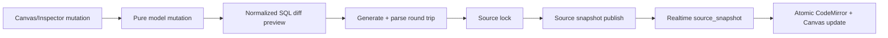

# SQLtoERD 선택·스키마 편집·Agent 안정화 설계

## 목적

SQLtoERD의 Canvas 선택, Inspector, SQL source, Agent 집중 보기를 하나의 일관된 session 편집 흐름으로 만든다. 사용자는 패널과 Canvas를 끊김 없이 조작하고, table 또는 column을 삭제·수정한 결과를 검증된 SQL source snapshot으로 저장하며, FK와 관련 SQL을 빠르게 오갈 수 있어야 한다.

이 작업은 Issue #1388의 단일 사용자 목표를 다룬다. DB schema와 migration은 변경하지 않는다. SQLtoERD feature 내부에서 해결할 수 있는 UI를 공통 shell로 올리지 않는다.

## 확정한 사용자 동작

- 열린 Inspector의 접기 버튼은 Canvas와 Inspector 경계 중앙에 반쯤 돌출해 표시한다. 전역 접속자·따라가기 UI와 겹치지 않는다.
- 선택하지 않았던 다른 Canvas component도 최초 pointer gesture에서 바로 선택하고 drag할 수 있다.
- table을 선택하면 incoming/outgoing FK relation을 contextual highlight로 진하게 표시한다. 실제 relation 다중 선택으로 취급하지 않는다.
- FK relation을 선택하면 source panel을 자동으로 열고 FK constraint 선언을 화면 중앙으로 이동한 뒤 잠시 강조한다.
- Inspector에는 `참조하는 컬럼`과 `참조되는 컬럼`으로 이동하는 보조 동작을 제공한다.
- table 또는 column 삭제와 table 이름, column 이름·타입 편집은 ERD model만 바꾸고 끝내지 않는다. normalized SQL diff preview, parse 검증, source lock, source snapshot publish를 거쳐 source와 model을 함께 갱신한다.
- Agent 집중 보기는 layout-only revision 변경으로 실패하지 않는다. inspect한 model fingerprint와 현재 model fingerprint가 같으면 focus를 허용한다.
- 큰 SQL source 외부 교체와 source-range navigation은 CodeMirror document, selection, decoration, scroll 상태를 일관되게 갱신한다.
- CORS는 현재 원격 dev가 정상 응답하므로 근거 없이 runtime 설정을 바꾸지 않는다. 재현 가능한 preflight smoke 검증과 장애 진단 절차를 제공한다.

## 범위 분해

### 1. Inspector와 Canvas interaction

Inspector `aside`를 위치 기준 컨테이너로 만들고 경계 중앙 handle이 열림 상태를 닫는다. 닫힌 상태의 기존 상세 패널 열기 affordance는 유지한다. handle은 Canvas resize hit area와 겹치지 않고 keyboard focus 및 접근 가능한 label을 제공한다.

table card의 DOM click과 tldraw selection이 pointer-up 뒤 서로 덮어쓰는 흐름을 없앤다. pointer-down capture에서 대상 table shape를 selection에 포함하되 event propagation을 막지 않아 같은 pointer sequence가 tldraw drag로 이어지게 한다. column click은 이동 임계값 안에서 끝난 경우에만 semantic column selection을 확정한다.

### 2. FK contextual highlight와 source navigation

table 선택에서 관련 relation ID 집합을 계산한다. 시각 우선순위는 다음과 같다.

1. 직접 선택한 FK
2. 선택 table에 연결된 FK
3. hover FK
4. 일반 FK

contextual highlight는 tldraw selected shape를 변경하지 않는다. 따라서 Delete, Inspector, keyboard command는 선택 table에만 적용된다. self-reference relation은 한 번만 포함한다.

기본 SQL 이동 위치는 `constraintRange`이다. FK를 소유한 참조하는 table에 선언이 존재하고, 참조되는 table에는 FK 선언이 없을 수 있기 때문이다. source map의 `fromColumnRanges`, `toColumnRanges`는 Inspector의 양 끝 이동 동작에 사용한다. 복합 FK는 해당 endpoint의 모든 column 식별자를 강조하고 첫 range를 중앙으로 이동한다.

navigation request는 range와 증가하는 request ID를 가진다. Source editor는 현재 document와 source map이 일치하고 range가 document 길이 안에 있을 때만 selection 및 `EditorView.scrollIntoView(..., { y: "center" })`를 적용한다. stale range는 조용히 무시하고 source map 재생성 후 다시 요청할 수 있게 한다.

### 3. CodeMirror 외부 snapshot 동기화

현재 외부 `value` 전체 교체와 relation decoration reconfigure가 별도 effect에서 dispatch돼 큰 document의 이전 viewport 위치가 잠시 남을 수 있다. 외부 source 교체는 한 dispatch에서 다음을 처리한다.

- document 전체 replace
- 새 document 길이로 clamp한 selection
- 새 source range로 계산한 decoration reconfigure
- navigation이 없는 경우 viewport 보존, 유효하지 않으면 document 시작점 복구

외부 교체 중 update listener가 source change를 다시 발행하지 않게 기존 guard를 유지한다. dialect/read-only reconfigure는 document replace와 독립적이지만 destroyed view에는 dispatch하지 않는다. 큰 source 축소, source snapshot 연속 적용, stale relation range, 접힌 source panel 자동 열기를 회귀 테스트한다.

### 4. Schema mutation과 SQL source publish

Canvas table/column Delete와 Inspector 편집은 공통 pure model mutation 계층을 사용한다.

- table delete: table, 해당 table의 layout, incoming/outgoing relation을 제거한다.
- column delete: column, 해당 column을 포함하는 PK/UQ constraint, incoming/outgoing relation을 제거한다. table에 column이 하나뿐이면 삭제를 거부하고 table 삭제를 안내한다.
- table rename: schema 내 동일 이름을 거부하고 table identity를 유지한 채 display name을 바꾼다.
- column rename: table 내 동일 이름을 거부하고 constraint/relation의 column ID 연결을 유지한다.
- column type edit: 공백을 정규화하고 빈 값, statement delimiter와 주석 토큰을 거부한다. 생성·reparse round trip이 실패하면 적용하지 않는다.

mutation은 기존 `createSqlErdNormalizedSqlPreview`를 통해 전체 canonical DDL diff를 만든다. 이는 dump의 비-ERD statement, 주석, 서식을 보존한다고 가장하지 않는다. preview 경고와 diff를 보여주고 사용자가 Apply한 뒤에만 source lock을 사용해 source snapshot을 publish한다. Apply 전에는 local history로 Undo할 수 있고 reload 시 유실될 수 있음을 기존 preview 상태로 표시한다.

publish는 operations_v1 계약을 그대로 따른다. legacy PATCH를 부활시키지 않는다. source lock이 없거나 다른 사용자가 보유 중이면 mutation control을 read-only로 두고, revision conflict 또는 remote source snapshot이 도착하면 stale preview를 폐기하고 최신 session을 보여준다.

### 5. Inspector 편집 UI

table view에는 table 이름 편집과 삭제, column view에는 column 이름·타입 편집과 삭제를 제공한다. 입력은 명시적 저장 버튼 또는 Enter로 preview를 만들고 Escape로 취소한다. source lock을 편집 field focus만으로 오래 점유하지 않고 preview Apply 시 기존 source writer 흐름이 획득한다.

PK/UQ/FK/nullable 자체 편집과 column 추가는 이번 범위가 아니다. column 삭제가 constraint를 제거하는 경우 confirmation에 영향을 받는 constraint와 relation 수를 표시한다.

### 6. Agent focus model 검증

`inspect_sql_erd_schema` 결과에 `modelFingerprint`를 포함한다. `focus_sql_erd_tables` 입력은 `sessionId`, 기존 `sessionRevision`, 새 `modelFingerprint`를 받는다. 서버는 현재 model fingerprint가 inspect 결과와 다르면 기존 conflict 메시지로 재검사를 요구한다. revision만 달라지고 fingerprint가 같으면 compact table ref를 현재 동일 model에 안전하게 적용한다.

revision은 진단과 resource metadata freshness에 유지하되 focus 실행의 schema identity 조건으로 사용하지 않는다. source publish로 model이 변하면 fingerprint가 달라져 stale focus를 거부한다. layout operation은 fingerprint를 바꾸지 않는다.

이 변경은 Agent tool API 계약 변경이므로 `docs/api/agent-api.md`와 `docs/api/sqltoerd-api.md`를 함께 갱신한다. DB와 Activity Log에는 변화가 없다.

### 7. CORS 회귀 검증

2026-07-18 원격 dev의 동일 endpoint는 `OPTIONS 204`, 허용 origin `https://dev.pilo.my`, credentials와 method/header allowlist를 정상 반환했다. 인증 없는 GET/POST의 401 응답에도 동일 origin header가 있었다. 따라서 증거 없이 App Server common bootstrap이나 Infra route를 변경하지 않는다.

대신 Agent runs endpoint에 대해 origin, method, request headers를 인자로 받는 read-only smoke script를 추가한다. 성공 조건은 preflight 2xx, 정확한 `Access-Control-Allow-Origin`, 요청 method/header 포함이다. 실패 시 HTTP status와 관찰한 CORS header만 출력하고 token이나 response body는 기록하지 않는다. 배포 replica/ingress 장애는 PR 코드 수정 범위 밖이며 runbook에 request ID, status, responding revision을 수집하도록 적는다.

## 상태와 데이터 흐름

Canvas selection, FK contextual highlight와 source navigation은 local view state이다. layout operation이나 source snapshot에 저장하지 않는다. durable schema change는 source snapshot 하나로만 확정한다.

## 오류 처리

- source lock 획득 실패: 편집 결과를 publish하지 않고 보유자 정보 노출 없이 충돌 안내를 표시한다.
- stale normalized preview: Apply를 막고 최신 session 기준으로 다시 편집하도록 안내한다.
- parse/generate 실패: 원래 model/source를 유지하고 preview에 구체적인 dialect 오류를 표시한다.
- table 마지막 column 삭제: column 삭제를 거부하고 table 삭제 선택지를 제공한다.
- 연결 constraint가 있는 column/table 삭제: 영향을 confirmation에 표시하고 승인 시 함께 제거한다.
- invalid source range: scroll하지 않고 CodeMirror state를 유지한다.
- Agent model fingerprint 불일치: inspect를 다시 실행하도록 conflict를 반환한다.
- CORS smoke 실패: 배포/ingress 진단 정보만 출력하고 client retry로 우회하지 않는다.

## API와 영향 범위

- API 계약 변경: 있음 — SQLtoERD Agent inspect/focus tool의 `modelFingerprint`.
- DB schema/migration: 없음.
- Frontend 공통 영역: 없음.
- App Server 공통 영역: 없음.
- 다른 도메인: Agent tool contract와 배포 후 CORS 검증.
- 담당자 확인: sqltoerd 담당자와 Agent 관련 리뷰가 필요하며 CORS smoke 결과는 Infra 담당자와 공유한다.

## 테스트 전략

### Frontend pure/unit contract

- table/column delete가 관련 constraint/relation만 제거하는지 검증
- duplicate rename, 마지막 column 삭제, unsafe data type 거부
- normalized SQL generate/reparse가 PostgreSQL/MySQL/SQLite에서 같은 model을 만드는지 검증
- table selection의 incoming/outgoing/self FK contextual highlight
- relation 선택 source target과 endpoint range 선택
- pointer-down selection 후 첫 gesture drag contract
- Inspector handle 위치와 공통 shell 미변경 assertion
- 큰 document replace와 stale decoration/navigation range clamp

### App Server Agent

- inspect output의 fingerprint 형식과 focus input schema
- layout-only revision mismatch + same fingerprint 허용
- source/model 변경 fingerprint mismatch 거부
- resource metadata와 compact ref 서버 재검증 유지

### Integration/regression

- 기존 SQLtoERD frontend/realtime script 전체
- App Server build와 SQLtoERD Agent tool test
- frontend typecheck/build와 format check
- dev CORS preflight smoke
- 두 브라우저 source lock, delete/edit publish, remote snapshot 반영 수동 검증

## 범위 밖

- PK/UQ/FK/nullable의 Inspector 직접 편집
- column 추가
- 원본 dump의 모든 비-ERD statement와 서식을 보존하는 AST rewrite
- CRDT 기반 SQL 동시 타이핑
- DB migration 또는 새로운 operation type
- CORS를 client retry나 wildcard origin으로 우회
- Agent 집중 보기를 session에 영속화
